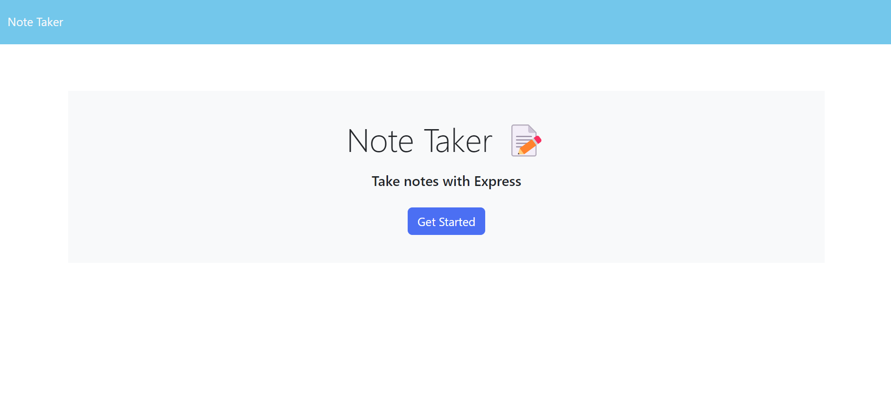
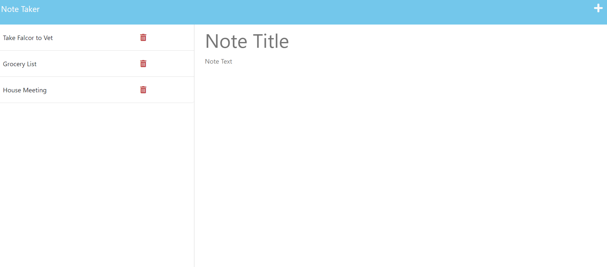
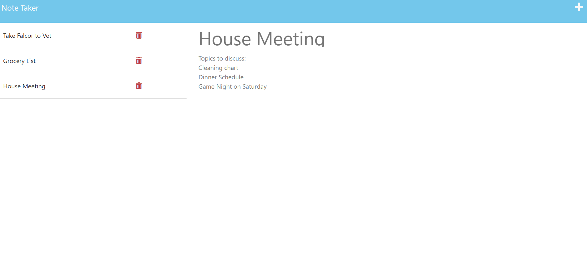

# Week11 Note Taker

## Description

I wanted to create a simple note/task builder application to provide users with an easy way to organize thoughts, keep track of tasks, or any other important information to improve productivity. Having learned the functionality of Express JS, I wanted to test my knowledge on linking front-end applications with back-end server processes. Being able to navigate the intricacies between front and back-end programs is an important skill in web-development. This application will help anyone who has trouble staying on task or remembering important information to be more productive throughout their day/week. I learned how to navigate a provided front-end application to correlate back-end code so the program runs efficiently and error-free. Utilizing given parameters from a front-end code was paramount in creating a seemless connection between the two.

## Table of Contents

- [Screenshots](#screenshots)

- [Credits](#credits)

- [License](#license)

- [Contributing](#contributing)

- [Tests](#tests)

- [Questions](#questions)

## Screenshots

Landing page:

Notes page:

Note view when clicking an existing note:

## Credits

- [Express JS - Express Routing](https://expressjs.com/en/guide/routing.html)

- [W3 Schools - Node JS: fs](https://www.w3schools.com/nodejs/nodejs_filesystem.asp#:~:text=Node.js%20as%20a%20File,Read%20files)

- [Stack Overflow - Frontend update/Delete Route](https://stackoverflow.com/questions/70815888/update-frontend-after-using-delete-route-in-express-js)

- [Stack Overflow - Removing and Object](https://stackoverflow.com/questions/70793597/how-can-i-remove-an-object-from-array-of-objects-in-app-delete-using-express)

- [Geeks for Geeks - Express JS app.delete()](https://www.geeksforgeeks.org/express-js-app-delete-function/)

- [Node JS - fs Methods](https://nodejs.org/api/fs.html)

- [Node JS - util.promisify()](https://nodejs.org/dist/latest-v8.x/docs/api/util.html#util_util_promisify_original)

- [NPM - util](https://www.npmjs.com/package/util)

- [NPM - uuid](https://www.npmjs.com/package/uuid)

## License

This application is covered under the following: [License: MIT](https://mit-license.org/)

## Contributing

[Contributor Covenant](https://www.contributor-covenant.org/version/2/1/code_of_conduct/code_of_conduct.txt)

## Tests

On the notes page, enter a new note and hit the save icon in the top right corner. The new note should appear in the column on the left. Once it is there, click the trash icon to delete the note from the list.

## Questions

Please visit my GitHub profile for more of my work:
[Joseph Stanion](https://github.com/JStanion)

For any questions about this application you can contact:
[Joseph Stanion](mailto:joseph.stanion@gmail.com)
